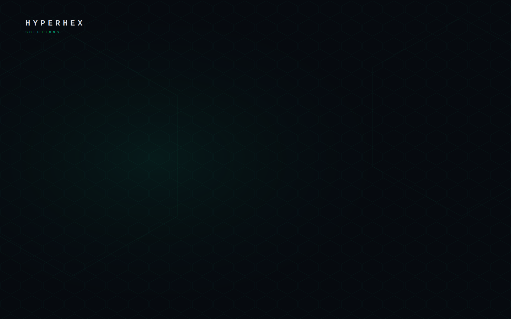

# ⬡ HyperHex Theme — ERPNext v15

Industrial theme for ERPNext / Frappe v15 by **HyperHex Solutions**.

Supports **Dark**, **Light**, and **Automatic** (system preference) themes.



---

## Design Tokens

### Dark Theme

| Token | Value |
|---|---|
| Accent Green | `#00FFB2` |
| Background Base | `#060A0F` |
| Surface | `#0C1219` |
| Elevated | `#121C27` |
| Border | `#1E2D3D` |

### Light Theme

| Token | Value |
|---|---|
| Accent Green | `#00CC8E` |
| Background Base | `#F0F2F5` |
| Surface | `#FFFFFF` |
| Elevated | `#E8EBF0` |
| Border | `#CBD0D9` |

### Typography (both themes)

| Element | Font |
|---|---|
| Display Font | Bebas Neue |
| Mono Font | DM Mono |
| Body Font | Barlow |

---

## Installation

### Prerequisites
- ERPNext v15 / Frappe v15
- Bench CLI installed

### Install via bench

```bash
# 1. Get the app
bench get-app https://github.com/hyperhexsolutions/hyperhex_theme
# OR from a local path:
bench get-app /path/to/hyperhex_theme

# 2. Install on your site
bench --site your-site.com install-app hyperhex_theme

# 3. Build assets
bench build --app hyperhex_theme

# 4. Restart bench
bench restart
```

### Install from a zip (no git)

```bash
# Extract the zip into your apps folder
cp -r hyperhex_theme /path/to/frappe-bench/apps/

# Install pip-editable
cd /path/to/frappe-bench
./env/bin/pip install -e apps/hyperhex_theme

# Install on site
bench --site your-site.com install-app hyperhex_theme
bench build --app hyperhex_theme
bench restart
```

---

## What Gets Themed

| Area | Status |
|---|---|
| Navbar / Topbar | ✅ |
| Sidebar | ✅ |
| Module Tiles (Home) | ✅ |
| Forms & Inputs | ✅ |
| Buttons | ✅ |
| Tables / List View | ✅ |
| Modals & Dialogs | ✅ |
| Kanban Board | ✅ |
| Charts & Dashboards | ✅ |
| Tabs & Navigation | ✅ |
| Alerts & Indicators | ✅ |
| Timeline / Activity | ✅ |
| Login Page | ✅ |
| Favicon | ✅ |

---

## Theme Switching

HyperHex supports three theme modes:

1. **HyperHex Dark** - Industrial dark theme
2. **HyperHex Light** - Industrial light theme
3. **Automatic** - Follows your system preference (light/dark)

### How to Switch Themes

1. Click your **avatar** in the top-right corner
2. Click **Toggle Theme**
3. Select your preferred theme

Or use the keyboard shortcut: **Ctrl + Shift + G**

Theme preference is saved per-user and persists across devices.

---

## Uninstall

```bash
bench --site your-site.com uninstall-app hyperhex_theme
bench build
bench restart
```

---

## License

MIT © HyperHex Solutions — hello@hyperhexsolutions.com
